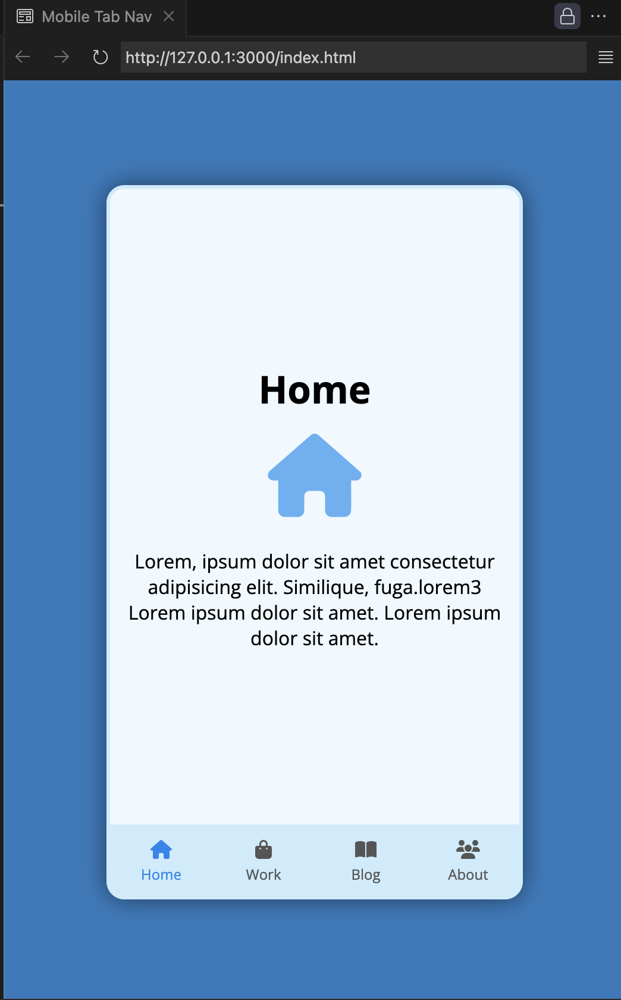

# Mobile Tab Navigation



A clean and interactive mobile tab navigation interface built with HTML, CSS, and JavaScript. This project mimics the behavior of a mobile app, allowing users to switch between different sections with a smooth transition effect. It's a great starting point for creating mobile-first designs or adding navigation functionality to your web applications.

## Key Features
- **Dynamic Tab Switching**: Seamlessly switch between tabs with a click, highlighting the active tab.
- **Smooth Transitions**: Each tab content fades in and out with a sleek opacity transition effect.
- **Responsive Design**: Designed for a mobile-sized screen, perfect for modern devices.
- **Intuitive UI**: Easy-to-navigate interface with icons and labels for each tab.

## Technologies Used
- **Frontend**: HTML, CSS (custom styling for a mobile-like experience).
- **JavaScript**: Tab switching functionality with event listeners and dynamic class manipulation.

## How to Run
1. Clone the repository:
   ```bash
   git clone https://github.com/yourusername/mobile-tab-nav.git
   cd mobile-tab-nav
   ```
2. Open `index.html` in your browser to see the project in action.

## Live Demo
Check out the live demo [here](https://chrisroland.github.io/Mobile-Tab-Nav/)

## Contributions
- Feel free to **open issues** if you encounter any bugs or have suggestions for improvement.
- **Pull requests** are welcome for feature additions or refinements.
- This project is **open-sourced**, and I am happy to receive **constructive feedback** and **collaborations**!

Thank you for checking out this project! ❤️